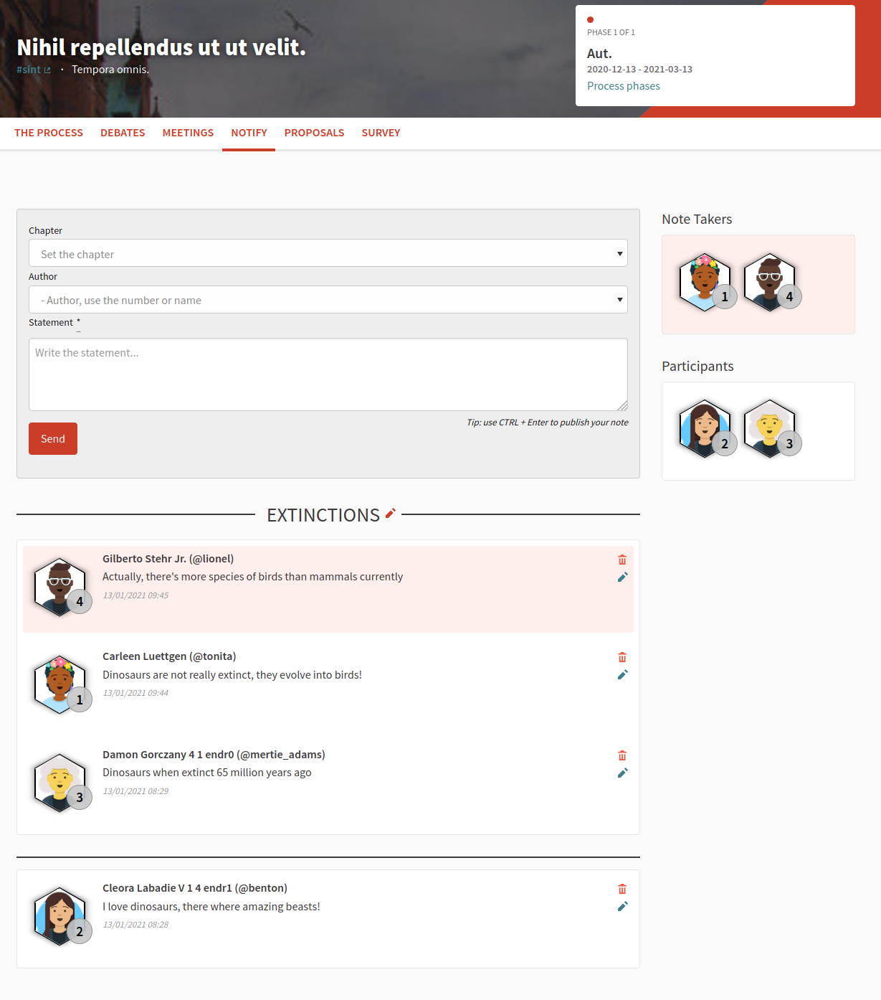

# Decidim::Notify

![[CI] Build Status](https://github.com/Platoniq/decidim-module-notify/workflows/%5BCI%5D%20Test%20Notify/badge.svg)
[](https://codeclimate.com/github/Platoniq/decidim-module-notify/maintainability)
[](https://codecov.io/gh/Platoniq/decidim-module-notify)


A note-taker feature focused on conversations. This module provides a component for any participatory space in Decidim.

## Usage

Notify will be available as a Component for a Participatory
Space.



## Installation

Add this line to your application's Gemfile:

```ruby
gem "decidim-notify", "~> 0.3.0"
```

And then execute:

```bash
bundle
bundle exec rails decidim_notify:install:migrations
bundle exec rails db:migrate
```

Depending on your Decidim version, choose the corresponding Plugin version to ensure compatibility:

| Notify version | Compatible Decidim versions |
|---|---|
| 0.3.x | 0.21.x - 0.23.x |

### Configuration

Notify uses [ActionCable](https://guides.rubyonrails.org/action_cable_overview.html) to display real time notes.

By default uses [PostgreSQL NOTIFY](https://www.postgresql.org/docs/9.0/sql-notify.html) as a backend for ActionCable. However, it is recommended to use Redis because PostgreSQL is limited to a 8000 characters to send messages.

To configure Redis use a custom initializer in you application, for instance `config/initializers/notify_config.rb`:

```ruby
Decidim::Notify.configure do |config|
  config.cable_adapter = "redis"
  config.cable_url = "redis://localhost:6379/1"
end
```

## Contributing

See [Decidim](https://github.com/decidim/decidim).


### Developing

To start contributing to this project, first:

- Install the basic dependencies (such as Ruby and PostgreSQL)
- Clone this repository

Decidim's main repository also provides a Docker configuration file if you
prefer to use Docker instead of installing the dependencies locally on your
machine.

You can create the development app by running the following commands after
cloning this project:

```bash
bundle
DATABASE_USERNAME=<username> DATABASE_PASSWORD=<password> bundle exec rake development_app
```

Note that the database user has to have rights to create and drop a database in
order to create the dummy test app database.

Then to test how the module works in Decidim, start the development server:

```bash
cd development_app
DATABASE_USERNAME=<username> DATABASE_PASSWORD=<password> bundle exec rails s
```

In case you are using [rbenv](https://github.com/rbenv/rbenv) and have the
[rbenv-vars](https://github.com/rbenv/rbenv-vars) plugin installed for it, you
can add the environment variables to the root directory of the project in a file
named `.rbenv-vars`. If these are defined for the environment, you can omit
defining these in the commands shown above.

#### Code Styling

Please follow the code styling defined by the different linters that ensure we
are all talking with the same language collaborating on the same project. This
project is set to follow the same rules that Decidim itself follows.

[Rubocop](https://rubocop.readthedocs.io/) linter is used for the Ruby language.

You can run the code styling checks by running the following commands from the
console:

```
bundle exec rubocop
```

To ease up following the style guide, you should install the plugin to your
favorite editor, such as:

- Atom - [linter-rubocop](https://atom.io/packages/linter-rubocop)
- Sublime Text - [Sublime RuboCop](https://github.com/pderichs/sublime_rubocop)
- Visual Studio Code - [Rubocop for Visual Studio Code](https://github.com/misogi/vscode-ruby-rubocop)

### Testing

To run the tests run the following in the gem development path:

```bash
bundle
DATABASE_USERNAME=<username> DATABASE_PASSWORD=<password> bundle exec rake test_app
DATABASE_USERNAME=<username> DATABASE_PASSWORD=<password> bundle exec rspec
```

Note that the database user has to have rights to create and drop a database in
order to create the dummy test app database.

In case you are using [rbenv](https://github.com/rbenv/rbenv) and have the
[rbenv-vars](https://github.com/rbenv/rbenv-vars) plugin installed for it, you
can add these environment variables to the root directory of the project in a
file named `.rbenv-vars`. In this case, you can omit defining these in the
commands shown above.

### Test code coverage

If you want to generate the code coverage report for the tests, you can use
the `SIMPLECOV=1` environment variable in the rspec command as follows:

```bash
SIMPLECOV=1 bundle exec rspec
```

This will generate a folder named `coverage` in the project root which contains
the code coverage report.

### Localization

If you would like to see this module in your own language, you can help with its
translation at Crowdin:

https://crowdin.com/translate/decidim-notify

## License

This engine is distributed under the GNU AFFERO GENERAL PUBLIC LICENSE.

## Credits

This plugin has been developed by 
